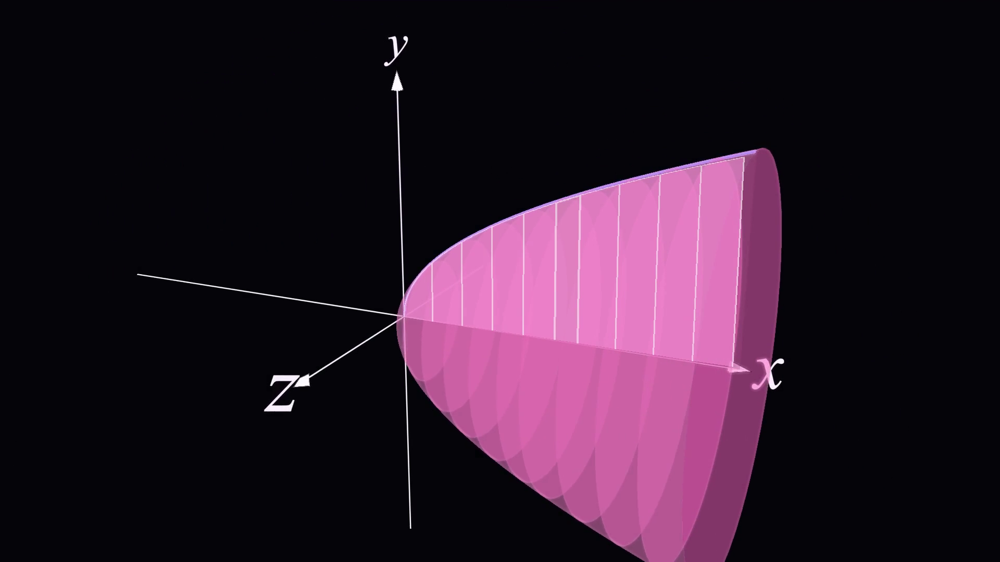
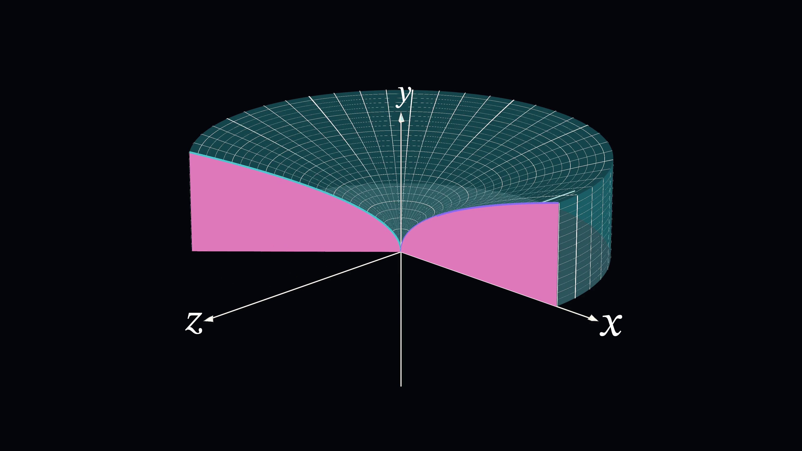
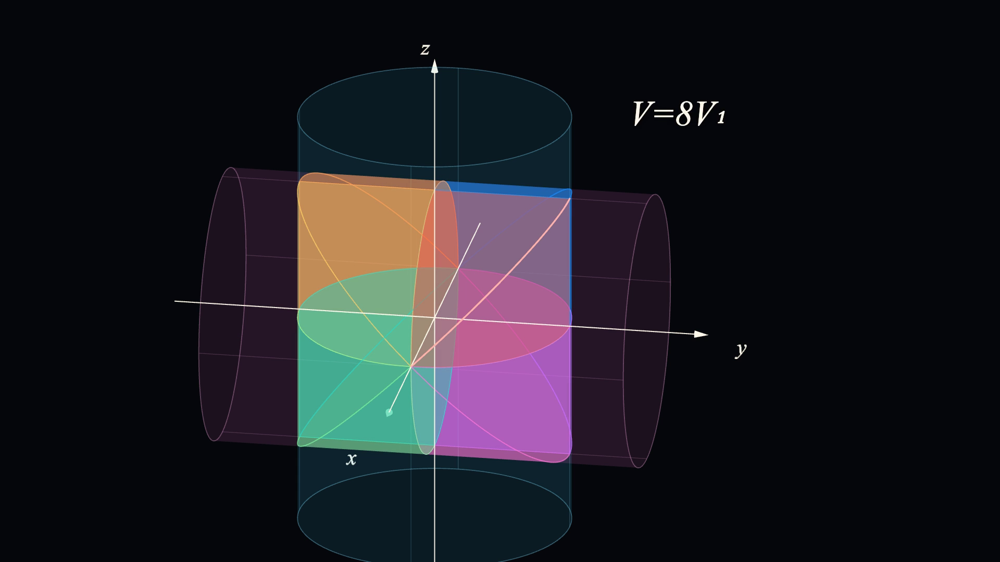

# 3DMath-lab

`3DMath-lab` 是一个 3D 数学动画作品与渲染管线仓库。这里保留三类内容：

- 可直接观看的最终成片
- 可复现成片的 ManimGL / Three.js 源码
- 相机、标签、关键帧与后期合成工具

如果只想看成果，先看 [`assets/final/`](assets/final/)。

## 成品索引

### 1. 圆盘切片与旋转体

- Final video: [`assets/final/volume-of-revolution/volume-of-revolution-1080p60.mp4`](assets/final/volume-of-revolution/volume-of-revolution-1080p60.mp4)
- Cover: [`assets/final/volume-of-revolution/cover.png`](assets/final/volume-of-revolution/cover.png)
- Notes: [`docs/works/volume-of-revolution.md`](docs/works/volume-of-revolution.md)



这条主片展示从二维面积微元到旋转体体积的过程，最终版为黑底、`1920x1080 / 60fps / 22.1s`。

### 2. `sqrt(x)` 绕 y 轴旋转参考片

- Phi 30: [`assets/final/sqrtx-y-rotation/sqrtx-y-rotation-phi30-4k60.mp4`](assets/final/sqrtx-y-rotation/sqrtx-y-rotation-phi30-4k60.mp4)
- Phi 70: [`assets/final/sqrtx-y-rotation/sqrtx-y-rotation-phi70-4k60.mp4`](assets/final/sqrtx-y-rotation/sqrtx-y-rotation-phi70-4k60.mp4)
- Notes: [`docs/works/sqrtx-y-rotation.md`](docs/works/sqrtx-y-rotation.md)



这组参考片展示 `sqrt(x)` 平面区域绕 y 轴旋转形成旋转体，保留 `phi30 / phi70` 两个固定视角，输出为 `3840x2160 / 60fps / 7.6s`。

### 3. Steinmetz 两圆柱相交

- Final video: [`assets/final/steinmetz-intersection/steinmetz-intersection-web3d-1080p60.mp4`](assets/final/steinmetz-intersection/steinmetz-intersection-web3d-1080p60.mp4)
- Cover: [`assets/final/steinmetz-intersection/cover.png`](assets/final/steinmetz-intersection/cover.png)
- Keyframes: [`assets/final/steinmetz-intersection/keyframes/`](assets/final/steinmetz-intersection/keyframes/)
- Notes: [`docs/works/steinmetz-intersection.md`](docs/works/steinmetz-intersection.md)



这条新片用 Three.js/Web3D 展示两个互相垂直的圆柱相交、第一卦限体积、俯视积分与八倍对称关系，输出为 `1920x1080 / 60fps / 34.0s`。

## 仓库结构

```text
assets/final/              正式成片、封面和精选关键帧
config/                    渲染与标签布局配置
docs/                      项目说明、作品记录与研究笔记
scripts/setup/             环境搭建脚本
scripts/render/            ManimGL 渲染与后期合成入口
scripts/analysis/          批处理、对比与分析工具
src/final-animation/       圆盘切片与旋转体主片代码
src/reference-animation/   sqrt(x) 绕 y 轴旋转参考片代码
tools/keyframe-editor/     相机、标签和关键帧编辑工具
web3d/                     Steinmetz 两圆柱相交 Three.js 动画
```

`output/`、`media/`、`web3d/node_modules/` 是本地生成目录，不进入版本控制。

## 快速运行

准备 ManimGL 环境：

```bash
bash scripts/setup/setup-manimgl-env.sh
```

生成圆盘切片与旋转体主片：

```bash
bash scripts/render/render-final-source.sh
bash scripts/render/render-final-overlay.sh
bash scripts/render/render-final-video.sh
```

生成 `sqrt(x)` 绕 y 轴旋转参考片：

```bash
bash scripts/render/render-sqrtx-reference.sh
```

运行 Steinmetz Web3D 项目：

```bash
cd web3d
npm install
npm run dev
```

渲染 Steinmetz 视频与关键帧：

```bash
cd web3d
npm run capture:video
```

## 补充说明

- 旧版扁平路径下的 `assets/final/volume-of-revolution-final-1080p60.mp4`、`cover.png` 等文件暂时保留，用于兼容已有链接。
- 参考片的升级记录见 [`docs/reference-video-upgrade.md`](docs/reference-video-upgrade.md)。
- 圆盘切片主片的完整生成链路见 [`docs/final-pipeline.md`](docs/final-pipeline.md)。
